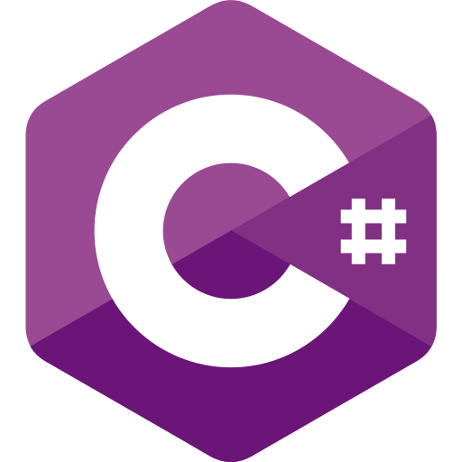

## About Me

- Graduated from Millersville University with a B.S. in Computer Science in 2021.
- Side interests include game development/computer graphics, programming languages, web development, and programming puzzles.
- Find me on [LinkedIn](https://www.linkedin.com/in/sfmalloy/)
- Check out my [itch.io](https://woodmancodes.itch.io) page for games I've made

## Projects I've Made by Language

    
    
    
    
        

